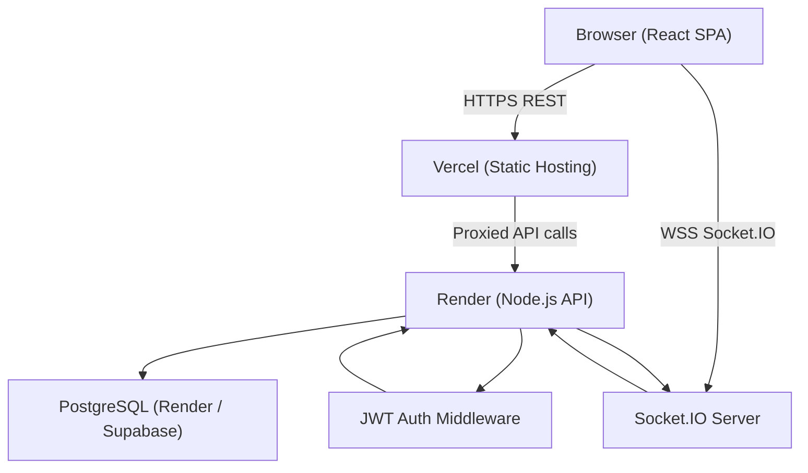
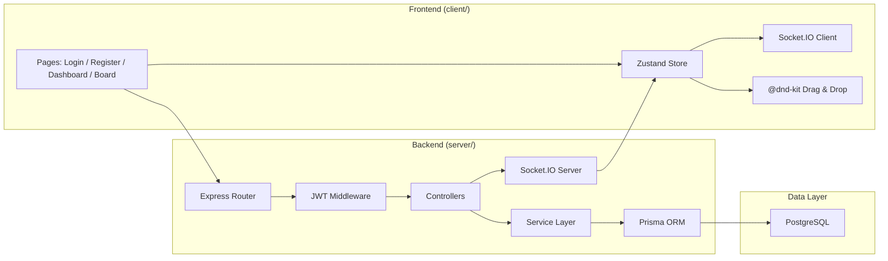
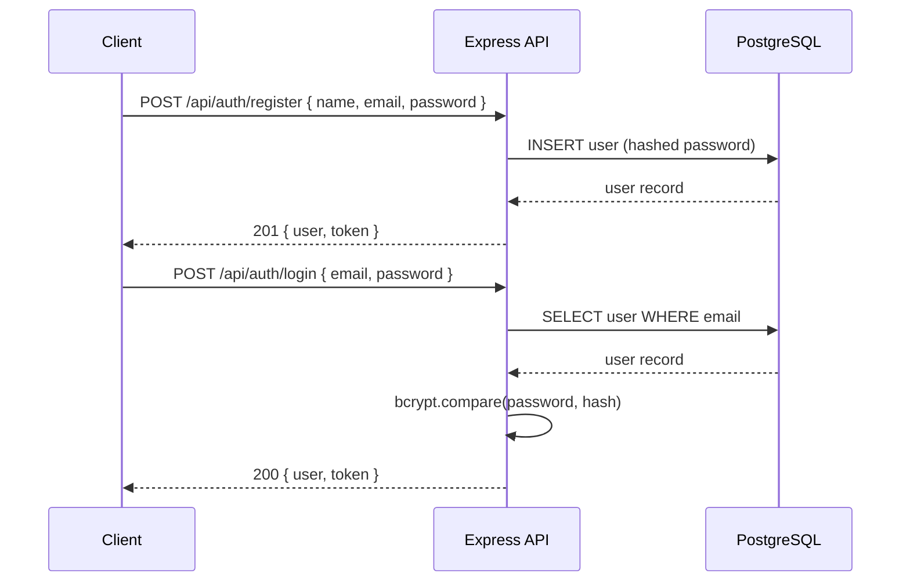
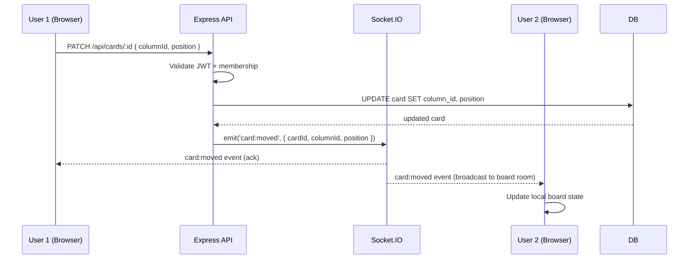
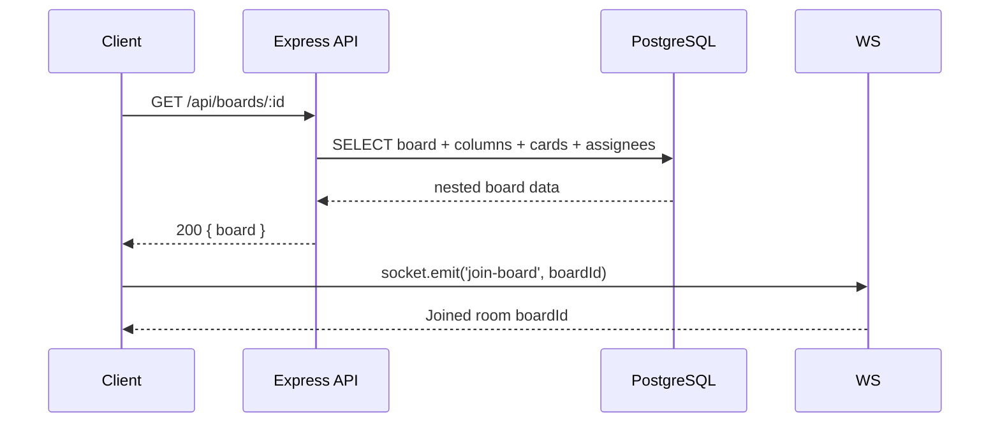

# Design Document: Multi-User Task Management System (Mini Trello)

## Overview

A full-stack collaborative task management application modeled after Trello, where users can organize work into boards with columns and draggable cards. The system supports real-time collaboration via WebSockets so multiple users on the same board see updates instantly, role-based access control (Admin vs Member), and JWT-based authentication. The application is designed for free-tier deployment on Render (backend) and Vercel (frontend).

The backend is a Node.js/Express REST API backed by PostgreSQL, using Socket.IO for real-time events. The frontend is a React + TypeScript SPA with drag-and-drop powered by `@dnd-kit`. Data persistence uses Prisma ORM for type-safe database access.

The entire project lives in a single GitHub monorepo with separate `client/` and `server/` workspaces, a shared `README.md` with the live deployment link, and CI/CD via GitHub Actions.

---

## Architecture





---

## Sequence Diagrams

### User Registration & Login



### Real-Time Card Move



### Board Load



---

## Components and Interfaces

### Component 1: Auth Service

**Purpose**: Handles user registration, login, and JWT issuance/verification.

**Interface**:
```typescript
interface AuthService {
  register(dto: RegisterDto): Promise<AuthResult>
  login(dto: LoginDto): Promise<AuthResult>
  verifyToken(token: string): JwtPayload
  hashPassword(plain: string): Promise<string>
  comparePassword(plain: string, hash: string): Promise<boolean>
}

interface RegisterDto {
  name: string
  email: string
  password: string   // min 8 chars
}

interface LoginDto {
  email: string
  password: string
}

interface AuthResult {
  user: PublicUser
  token: string      // JWT, expires in 7d
}

interface JwtPayload {
  sub: string        // userId
  email: string
  role: UserRole
  iat: number
  exp: number
}
```

**Responsibilities**:
- Hash passwords with bcrypt (salt rounds: 12)
- Sign JWTs with HS256 using `JWT_SECRET` env var
- Return sanitized user (no password hash)

---

### Component 2: Board Service

**Purpose**: CRUD for boards; manages board membership.

**Interface**:
```typescript
interface BoardService {
  createBoard(userId: string, dto: CreateBoardDto): Promise<Board>
  getBoard(boardId: string, userId: string): Promise<BoardWithColumns>
  listBoards(userId: string): Promise<Board[]>
  updateBoard(boardId: string, userId: string, dto: UpdateBoardDto): Promise<Board>
  deleteBoard(boardId: string, userId: string): Promise<void>
  addMember(boardId: string, adminId: string, memberId: string): Promise<void>
  removeMember(boardId: string, adminId: string, memberId: string): Promise<void>
}

interface CreateBoardDto {
  title: string
  description?: string
}

interface BoardWithColumns extends Board {
  columns: ColumnWithCards[]
  members: BoardMember[]
}
```

**Responsibilities**:
- Creator auto-becomes Admin member
- Only board Admins can add/remove members
- `getBoard` returns deeply nested data (columns → cards → assignee)

---

### Component 3: Column Service

**Purpose**: Manages columns (lists) within a board.

**Interface**:
```typescript
interface ColumnService {
  createColumn(boardId: string, userId: string, dto: CreateColumnDto): Promise<Column>
  updateColumn(columnId: string, userId: string, dto: UpdateColumnDto): Promise<Column>
  deleteColumn(columnId: string, userId: string): Promise<void>
  reorderColumns(boardId: string, userId: string, orderedIds: string[]): Promise<void>
}

interface CreateColumnDto {
  title: string        // e.g. "To Do", "In Progress", "Done"
  position: number
}
```

**Responsibilities**:
- Default board gets 3 columns seeded on creation
- Position is integer; reorder updates all affected rows in a transaction
- Only board Admins can create/delete columns

---

### Component 4: Card Service

**Purpose**: Full lifecycle management of task cards.

**Interface**:
```typescript
interface CardService {
  createCard(columnId: string, userId: string, dto: CreateCardDto): Promise<Card>
  getCard(cardId: string, userId: string): Promise<CardDetail>
  updateCard(cardId: string, userId: string, dto: UpdateCardDto): Promise<Card>
  moveCard(cardId: string, userId: string, dto: MoveCardDto): Promise<Card>
  deleteCard(cardId: string, userId: string): Promise<void>
}

interface CreateCardDto {
  title: string
  description?: string
  assigneeId?: string
  dueDate?: Date
  priority: Priority
}

interface UpdateCardDto extends Partial<CreateCardDto> {}

interface MoveCardDto {
  targetColumnId: string
  position: number
}

type Priority = 'LOW' | 'MEDIUM' | 'HIGH' | 'URGENT'
```

**Responsibilities**:
- Members can create/edit/delete only their own cards
- Admins can manage any card on their boards
- `moveCard` emits `card:moved` Socket.IO event after DB update
- Position gaps of 1000 (like LexoRank lite) to minimize re-indexing

---

### Component 5: Real-Time Gateway (Socket.IO)

**Purpose**: Broadcasts board mutations to all connected clients in a room.

**Interface**:
```typescript
interface SocketGateway {
  joinBoard(socket: Socket, boardId: string): void
  leaveBoard(socket: Socket, boardId: string): void
  emitCardMoved(boardId: string, payload: CardMovedPayload): void
  emitCardUpdated(boardId: string, payload: CardUpdatedPayload): void
  emitCardCreated(boardId: string, payload: Card): void
  emitCardDeleted(boardId: string, cardId: string): void
  emitColumnCreated(boardId: string, payload: Column): void
  emitColumnDeleted(boardId: string, columnId: string): void
}

interface CardMovedPayload {
  cardId: string
  sourceColumnId: string
  targetColumnId: string
  position: number
}
```

**Responsibilities**:
- Authenticate socket connections using JWT in handshake `auth.token`
- Board rooms named `board:{boardId}`
- All mutations from HTTP handlers emit events via the gateway

---

### Component 6: Admin Controller

**Purpose**: Admin-only endpoints for user management.

**Interface**:
```typescript
interface AdminController {
  listUsers(req: AuthRequest): Promise<PublicUser[]>
  updateUserRole(req: AuthRequest, userId: string, role: UserRole): Promise<PublicUser>
  deleteUser(req: AuthRequest, userId: string): Promise<void>
}

type UserRole = 'ADMIN' | 'MEMBER'
```

**Responsibilities**:
- Protected by `requireRole('ADMIN')` middleware (system-level admin)
- Cannot delete self

---

## Data Models

### User

```typescript
interface User {
  id: string           // UUID
  name: string
  email: string        // unique
  passwordHash: string
  role: UserRole       // system role: ADMIN | MEMBER
  createdAt: Date
  updatedAt: Date
}

type PublicUser = Omit<User, 'passwordHash'>
```

**Validation Rules**:
- `email` must be valid RFC 5321 format and unique
- `password` minimum 8 characters before hashing
- `name` 2–100 characters

---

### Board

```typescript
interface Board {
  id: string
  title: string        // 1–100 chars
  description?: string
  ownerId: string      // FK → User
  createdAt: Date
  updatedAt: Date
}

interface BoardMember {
  boardId: string
  userId: string
  role: BoardRole      // board-level role: ADMIN | MEMBER
}

type BoardRole = 'ADMIN' | 'MEMBER'
```

---

### Column

```typescript
interface Column {
  id: string
  title: string        // 1–50 chars
  boardId: string      // FK → Board
  position: number     // integer, ascending, unique within board
  createdAt: Date
  updatedAt: Date
}
```

---

### Card

```typescript
interface Card {
  id: string
  title: string        // 1–200 chars
  description?: string // markdown supported
  columnId: string     // FK → Column
  assigneeId?: string  // FK → User
  dueDate?: Date
  priority: Priority   // LOW | MEDIUM | HIGH | URGENT
  position: number     // integer, ascending, unique within column
  createdAt: Date
  updatedAt: Date
}

interface CardDetail extends Card {
  assignee?: PublicUser
  column: Column
}
```

**Validation Rules**:
- `title` required, max 200 chars
- `priority` defaults to `'MEDIUM'`
- `dueDate` must be ISO 8601 if provided
- `position` must be ≥ 0

---

## Algorithmic Pseudocode

### Main Card Move Algorithm

```typescript
async function moveCard(cardId: string, userId: string, dto: MoveCardDto): Promise<Card> {
  // Preconditions:
  //   cardId is a valid existing card
  //   userId is a member of the board the card belongs to
  //   dto.targetColumnId belongs to the same board
  //   dto.position >= 0

  const card = await prisma.card.findUniqueOrThrow({ where: { id: cardId } })
  const board = await getBoardForColumn(card.columnId)
  assertMembership(userId, board.id)   // throws 403 if not member

  if (card.createdById !== userId) {
    assertBoardRole(userId, board.id, 'ADMIN')  // members can only move own cards
  }

  const targetColumn = await prisma.column.findUniqueOrThrow({
    where: { id: dto.targetColumnId }
  })
  assert(targetColumn.boardId === board.id, 'Column not in same board')

  // Shift positions of cards at and after dto.position in target column
  // Loop invariant: cards[0..i-1] have been shifted up by 1 correctly
  await prisma.$transaction(async (tx) => {
    await tx.card.updateMany({
      where: {
        columnId: dto.targetColumnId,
        position: { gte: dto.position },
        id: { not: cardId }
      },
      data: { position: { increment: 1 } }
    })

    await tx.card.update({
      where: { id: cardId },
      data: {
        columnId: dto.targetColumnId,
        position: dto.position
      }
    })
  })

  const updated = await prisma.card.findUniqueOrThrow({ where: { id: cardId } })

  // Postcondition: card.columnId === dto.targetColumnId && card.position === dto.position
  socketGateway.emitCardMoved(board.id, {
    cardId,
    sourceColumnId: card.columnId,
    targetColumnId: dto.targetColumnId,
    position: dto.position
  })

  return updated
}
```

**Preconditions:**
- `cardId` references an existing card
- `userId` is authenticated and is a board member
- `dto.targetColumnId` belongs to the same board as the card
- `dto.position` is a non-negative integer

**Postconditions:**
- Card's `columnId` equals `dto.targetColumnId`
- Card's `position` equals `dto.position`
- All previously lower-positioned cards in target column shifted by +1
- `card:moved` event emitted to board room

**Loop Invariants:**
- All cards in the target column at positions ≥ dto.position have been incremented exactly once
- No card is left with a duplicate position within a column after the transaction

---

### JWT Authentication Middleware

```typescript
async function authenticate(req: Request, res: Response, next: NextFunction): Promise<void> {
  // Precondition: req has Authorization header OR cookie 'token'

  const raw = req.headers.authorization?.replace('Bearer ', '') 
               ?? req.cookies?.token

  if (!raw) {
    res.status(401).json({ error: 'No token provided' })
    return
  }

  try {
    const payload = jwt.verify(raw, process.env.JWT_SECRET!) as JwtPayload
    // Postcondition: payload.sub is a valid userId, payload.exp > now()
    req.user = payload
    next()
  } catch (err) {
    res.status(401).json({ error: 'Invalid or expired token' })
  }
}
```

**Preconditions:**
- `JWT_SECRET` environment variable is set
- Token is a string (may be invalid/expired)

**Postconditions:**
- On success: `req.user` is populated with valid `JwtPayload`, `next()` called
- On failure: 401 response sent, middleware chain halted

---

### Position Rebalancing Algorithm (Column Reorder)

```typescript
async function reorderColumns(boardId: string, userId: string, orderedIds: string[]): Promise<void> {
  // Preconditions:
  //   userId is ADMIN of boardId
  //   orderedIds contains exactly all columnIds belonging to boardId
  //   orderedIds has no duplicates

  assertBoardRole(userId, boardId, 'ADMIN')

  const existingColumns = await prisma.column.findMany({ where: { boardId } })
  assert(
    orderedIds.length === existingColumns.length &&
    orderedIds.every(id => existingColumns.some(c => c.id === id)),
    'orderedIds must be exact permutation of board columns'
  )

  // Assign positions 0, 1, 2, ... based on provided order
  // Loop invariant: all columns at indices [0..i-1] have correct position i
  await prisma.$transaction(
    orderedIds.map((id, index) =>
      prisma.column.update({ where: { id }, data: { position: index } })
    )
  )

  // Postcondition: ∀ i ∈ [0, orderedIds.length), column(orderedIds[i]).position === i
}
```

**Preconditions:**
- `userId` has ADMIN role on the board
- `orderedIds` is a permutation of all column IDs on the board

**Postconditions:**
- Column positions are 0-indexed consecutive integers matching `orderedIds` order
- No two columns share the same position within the board

---

## Key Functions with Formal Specifications

### `register(dto: RegisterDto): Promise<AuthResult>`

**Preconditions:**
- `dto.email` matches RFC 5321 email format
- `dto.password.length >= 8`
- No existing user with `dto.email`

**Postconditions:**
- A new user row exists in the database with hashed password
- Returns `AuthResult` with sanitized user and signed JWT
- `result.token` decodes to `{ sub: user.id, email: user.email, role: 'MEMBER' }`

---

### `createCard(columnId, userId, dto): Promise<Card>`

**Preconditions:**
- Column with `columnId` exists
- `userId` is a member of the board containing the column
- `dto.title.length` in [1, 200]
- `dto.priority` is one of `LOW | MEDIUM | HIGH | URGENT`

**Postconditions:**
- New card row created with `columnId`, `position = max(existing positions) + 1`
- `card:created` Socket.IO event emitted to `board:{boardId}`
- Returns the created card

---

### `deleteCard(cardId, userId): Promise<void>`

**Preconditions:**
- Card with `cardId` exists
- `userId` is a member of the board
- Either `card.createdById === userId` OR `userId` has ADMIN role on board

**Postconditions:**
- Card row deleted from database
- `card:deleted` event emitted with `cardId`
- Positions of remaining cards in same column NOT re-indexed (sparse OK)

---

## Example Usage

### Frontend: Drag-and-Drop Card Move

```typescript
// Inside Board.tsx using @dnd-kit
import { useDndContext, DragEndEvent } from '@dnd-kit/core'

async function handleDragEnd(event: DragEndEvent) {
  const { active, over } = event
  if (!over || active.id === over.id) return

  const cardId = active.id as string
  const targetColumnId = over.data.current?.columnId as string
  const position = over.data.current?.position as number

  // Optimistic update
  boardStore.moveCardOptimistic(cardId, targetColumnId, position)

  try {
    await api.patch(`/cards/${cardId}/move`, { targetColumnId, position })
    // Server emits card:moved via Socket.IO — remote clients update automatically
  } catch (err) {
    boardStore.revertLastMove()  // rollback optimistic update
    toast.error('Failed to move card')
  }
}
```

### Backend: Socket.IO Authentication Handshake

```typescript
io.use(async (socket, next) => {
  const token = socket.handshake.auth.token as string
  if (!token) return next(new Error('Authentication required'))

  try {
    const payload = jwt.verify(token, process.env.JWT_SECRET!) as JwtPayload
    socket.data.user = payload
    next()
  } catch {
    next(new Error('Invalid token'))
  }
})

io.on('connection', (socket) => {
  socket.on('join-board', async (boardId: string) => {
    const isMember = await boardService.isMember(boardId, socket.data.user.sub)
    if (!isMember) {
      socket.emit('error', { message: 'Not a board member' })
      return
    }
    socket.join(`board:${boardId}`)
  })
})
```

### API: Create Card

```typescript
// POST /api/boards/:boardId/columns/:columnId/cards
router.post('/:boardId/columns/:columnId/cards', authenticate, async (req, res) => {
  const card = await cardService.createCard(
    req.params.columnId,
    req.user.sub,
    req.body as CreateCardDto
  )
  res.status(201).json(card)
})
```

---

## Correctness Properties

- **Auth uniqueness**: For all registration attempts, if a user with the same email already exists, registration MUST fail with 409 Conflict.
- **JWT validity**: For all authenticated requests, if `JWT_SECRET` changes, all previously issued tokens MUST be rejected.
- **Card isolation**: For all cards, a Member user MUST NOT be able to update or delete a card they did not create.
- **Board membership gate**: For all board operations, a user NOT in `board_members` MUST receive 403 for any read or write operation on that board.
- **Position uniqueness**: For all columns at all times, no two cards in the same column SHALL share the same position value.
- **Real-time consistency**: For all card move operations, every connected client in the board room MUST receive the `card:moved` event within 1 second of the HTTP response.
- **Admin privilege**: For all system-admin operations (list users, change roles), only users with `role = 'ADMIN'` at the system level SHALL have access.
- **Data integrity**: For all board deletions, all associated columns, cards, and board-member records MUST be cascade-deleted.

---

## Error Handling

### Scenario 1: Invalid or Expired JWT

**Condition**: Token is malformed, expired, or signed with wrong secret  
**Response**: HTTP 401 `{ error: 'Invalid or expired token' }`  
**Recovery**: Client redirects to `/login`, clears stored token

### Scenario 2: Unauthorized Card Operation

**Condition**: Member attempts to edit/delete another user's card  
**Response**: HTTP 403 `{ error: 'Forbidden: you do not own this card' }`  
**Recovery**: Frontend disables edit/delete buttons for non-owned cards; server enforces as defense-in-depth

### Scenario 3: Concurrent Card Position Conflict

**Condition**: Two users move cards to the same position simultaneously  
**Response**: Both transactions succeed inside DB transaction; last-write-wins on position; Socket.IO reconciles state  
**Recovery**: After both `card:moved` events fire, frontend re-renders board from authoritative server state

### Scenario 4: WebSocket Disconnect

**Condition**: User loses connection mid-session  
**Response**: Socket.IO auto-reconnects with exponential backoff (max 5 retries)  
**Recovery**: On reconnect, client re-emits `join-board` and fetches board state via REST to reconcile missed events

### Scenario 5: Database Unavailable

**Condition**: PostgreSQL connection fails  
**Response**: HTTP 503 `{ error: 'Service temporarily unavailable' }` for all data endpoints  
**Recovery**: Express error handler catches Prisma `PrismaClientKnownRequestError`; logs to console; no crash

---

## Testing Strategy

### Unit Testing Approach

Framework: **Vitest** (server) + **React Testing Library** (client)

Key unit test cases:
- `AuthService.register`: valid input creates user; duplicate email throws; short password throws
- `CardService.moveCard`: card moves to correct column and position; non-member throws 403; non-owner member throws 403
- `ColumnService.reorderColumns`: valid permutation reorders; partial list throws; non-admin throws 403
- JWT middleware: valid token passes; expired token returns 401; missing header returns 401

### Property-Based Testing Approach

Framework: **fast-check** (TypeScript)

**Property Test Library**: fast-check

Properties to test:
- For any valid card position assignment, no two cards in the same column share a position after `moveCard`
- For any permutation of column IDs, `reorderColumns` produces positions [0, 1, 2, ..., n-1]
- For any JWT signed with a given secret, verification with a different secret always fails
- For any sequence of card create/move/delete operations, the final board state matches a sequential replay

### Integration Testing Approach

Framework: **Supertest** + test PostgreSQL database (Docker)

- `POST /api/auth/register → POST /api/auth/login` full round-trip
- `POST /api/boards` creates board with 3 default columns
- `PATCH /api/cards/:id/move` updates DB and emits Socket.IO event
- Admin-only routes return 403 for MEMBER role users

---

## Performance Considerations

- **Database indexes**: Add indexes on `cards.column_id`, `cards.position`, `columns.board_id`, `board_members.user_id` to support fast board loads
- **Socket.IO rooms**: Each board is an isolated room; broadcasts are O(n) for n members, expected to be small (< 50 per board)
- **N+1 prevention**: Use Prisma `include` to eagerly load columns → cards → assignee in a single query per board load
- **Optimistic updates**: Frontend applies drag-and-drop visually before API response returns, keeping UI snappy
- **Rate limiting**: Apply `express-rate-limit` (100 req/min per IP) on all API routes to protect free-tier resources
- **Connection pooling**: Use Prisma's built-in connection pool; set `connection_limit=5` for Render free tier (512 MB RAM)

---

## Security Considerations

- **Password storage**: bcrypt with 12 salt rounds; plaintext passwords never logged or returned
- **JWT secret**: 256-bit random secret in `JWT_SECRET` env var; never committed to git
- **CORS**: Restrict `Access-Control-Allow-Origin` to the Vercel frontend domain in production
- **Input validation**: `zod` schema validation on all request bodies; strip unknown fields
- **SQL injection**: Prisma's parameterized queries prevent injection; no raw SQL used
- **Authorization checks**: Every service function verifies board membership before accessing data (defense-in-depth beyond middleware)
- **HTTPS**: Render and Vercel both enforce HTTPS; cookie `Secure` + `HttpOnly` flags if using cookie auth
- **Helmet**: Apply `helmet` middleware to set security headers (CSP, HSTS, X-Frame-Options)
- **Sensitive data**: `.env` in `.gitignore`; example values only in `.env.example`

---

## Dependencies

### Backend (`server/`)

| Package | Purpose |
|---|---|
| `express` | HTTP server framework |
| `prisma` + `@prisma/client` | ORM + type-safe DB queries |
| `socket.io` | WebSocket server |
| `jsonwebtoken` | JWT sign/verify |
| `bcryptjs` | Password hashing |
| `zod` | Request body validation |
| `cors` | CORS middleware |
| `helmet` | Security headers |
| `express-rate-limit` | Rate limiting |
| `dotenv` | Env var loading |

### Frontend (`client/`)

| Package | Purpose |
|---|---|
| `react` + `react-dom` | UI framework |
| `typescript` | Type safety |
| `vite` | Build tool |
| `react-router-dom` | Client-side routing |
| `zustand` | Global state management |
| `@dnd-kit/core` + `@dnd-kit/sortable` | Drag-and-drop |
| `socket.io-client` | WebSocket client |
| `axios` | HTTP client |
| `react-hook-form` + `zod` | Form validation |
| `@radix-ui/react-*` | Accessible UI primitives |
| `tailwindcss` | Utility-first CSS |
| `date-fns` | Date formatting |

### Database

- **PostgreSQL 15** — hosted on [Supabase](https://supabase.com) free tier or Render's managed Postgres
